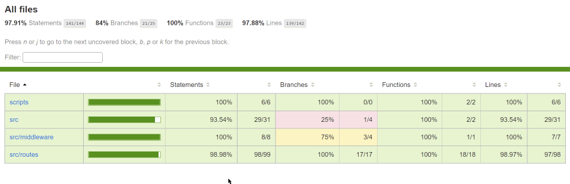

# DEEL BACKEND TASK Steve Hermes



Access modified code at https://github.com/shermes641/DEEL/tree/main

Code developed and tested on Windows 10, node v14.18.2  npm 6.14.15

## TODO

Setup CI, I like CircleCI

More exhaustive tests, remove hardcoded values and magic numbers

Get test results with direct DB calls to verify API returns the same

## APIs To Implement

1. ***GET*** `/contracts/:id` - This API is broken 😵! it should return the contract only if it belongs to the profile calling. better fix that!

        Moved to src/routes/contracts.js, tested in src/tests/contract.test.js

2. ***GET*** `/contracts` - Returns a list of contracts belonging to a user (client or contractor), the list should only contain non terminated contracts.
    
        tested in src/tests/contract.test.js

3. ***GET*** `/jobs/unpaid` -  Get all unpaid jobs for a user (***either*** a client or contractor), for ***active contracts only***.

        tested in src/tests/job.test.js

4. ***POST*** `/jobs/:job_id/pay` - Pay for a job, a client can only pay if his balance >= the amount to pay. The amount should be moved from the client's balance to the contractor balance.

        tested in src/tests/job.test.js

5. ***POST*** `/balances/deposit/:userId` - Deposits money into the balance of a client, a client can't deposit more than 25% his total of jobs to pay. (at the deposit moment)

        tested in src/tests/balance.test.js

6. ***GET*** `/admin/best-profession?start=<date>&end=<date>` - Returns the profession that earned the most money (sum of jobs paid) for any contactor that worked in the query time range.

        tested in src/tests/admin.test.js

7. ***GET*** `/admin/best-clients?start=<date>&end=<date>&limit=<integer>` - returns the clients the paid the most for jobs in the query time period. limit query parameter should be applied, default limit is 2.

        tested in src/tests/admin.test.js

## Getting Set Up

1. In the repo root directory, run `npm install` to gather all dependencies.

   
      PS E:\_DEEL\deal-test> npm install
   
      npm WARN optional SKIPPING OPTIONAL DEPENDENCY: fsevents@2.3.2 (node_modules\fsevents):
      npm WARN notsup SKIPPING OPTIONAL DEPENDENCY: Unsupported platform for fsevents@2.3.2: wanted {"os":"darwin","arch":"any"} (current: {"os":"win32","arch":"x64"})
   
      audited 591 packages in 6.14s
   
      48 packages are looking for funding
      run `npm fund` for details
   
      found 0 vulnerabilities


2. Next, `npm run seed` will create and seed the local SQLite database. 


      PS E:\_DEEL\deal-test> npm run seed

      > deel-task@0.1.0 seed E:\_DEEL\deal-test
      > node ./scripts/createSeedDb.js
      
      Expect undefined: undefined


3. Run `npm start`


      PS E:\_DEEL\deal-test> npm start
      
      > deel-task@0.1.0 start E:\_DEEL\deal-test
      > nodemon --inspect ./src/server.js
      
      [nodemon] 2.0.12
      [nodemon] to restart at any time, enter `rs`       
      [nodemon] watching path(s): *.*                    
      [nodemon] watching extensions: js,mjs,json         
      [nodemon] starting `node --inspect ./src/server.js`
      Debugger listening on ws://127.0.0.1:9229/c55d57a7-2194-4386-a03b-5835b6c8dd7a
      For help, see: https://nodejs.org/en/docs/inspector                           
      Express App Listening on Port 3001
      expect "undefined": undefined


4. Go to `http://localhost:3001/api-docs` to access the API using Swagger

## Tests

There are API tests for the main routes.

To run all test, execute `npm test`

Output:

      PS E:\_DEEL\deal-test> npm test
      
      > deel-task@0.1.0 test E:\_DEEL\deal-test
      > jest --verbose --runInBand ./src/tests
      
      PASS  src/tests/contract.test.js
      Contracts
      /contracts/:id
      √ return 401 when profile_id does not exist (268 ms)
      √ return 404 when contract not found (166 ms)
      √ return 404 when profile_id mismatch with client or contractor (150 ms)
      √ return contract when profile_id  matches with client (160 ms)
      √ return contract when profile_id  matches with client (159 ms)
      √ return contract when profile_id matches with client (174 ms)
      /contracts
      √ return active contracts for the client (162 ms)
      √ return active contracts for the client (142 ms)
      
      PASS  src/tests/job.test.js
      Jobs
      /jobs/unpaid
      √ return unpaid jobs (299 ms)
      √ return unpaid jobs if in_progress (155 ms)
      √ return {}, profile_id does not exist (152 ms)
      /jobs/:id/pay
      √ return 404 when job is not found (165 ms)
      √ return 409 if job is already paid (161 ms)
      √ return 400, client has insufficient funds (157 ms)
      √ client pays contractor (177 ms)
      √ mark job as paid (177 ms)
      
      PASS  src/tests/admin.test.js
      Admin Tests
      /admin/best-profession
      √ returns profession with the highest income in the time range (244 ms)
      √ returns null, no jobs in the time range (177 ms)
      /admin/best-clients
      √ return all clients who paid most within in the time range (7 ms)
      √ return ordered list, default 2 elements,  by total paid DESC (9 ms)
      √ limit the returned list by query param (10 ms)
      √ return [] with no jobs within given time range (7 ms)
      
      PASS  src/tests/balance.test.js
      Balances
      /balances/deposit/:userId
      √ no jobs, so error (281 ms)
      √ increase clients balance (178 ms)
      √ returns 400 if deposit exceeds the threshold of 0.25 of unpaid jobs sum (168 ms)
      √ returns 404 if client is not found (186 ms)
      √ returns 404 if user is not a client (182 ms)
      
      Test Suites: 4 passed, 4 total  
      Tests:       27 passed, 27 total
      Snapshots:   0 total            
      Time:        9.164 s
      Ran all test suites matching /.\\src\\tests/i.

If you use WebStorm there is a `all tests` config. You can run it with code coverage


## MISC

I modified the files in the `scripts` directory, such that the DB could be restored between individual tests.

The original file caused errors in the test code 

_____________________

# === ORIGINAL README ===

# DEEL BACKEND TASK


💫 Welcome! 🎉


This backend exercise involves building a Node.js/Express.js app that will serve a REST API. We imagine you should spend around 3 hours at implement this feature.

## Data Models

> **All models are defined in src/model.js**

### Profile
A profile can be either a `client` or a `contractor`.
clients create contracts with contractors. contractor does jobs for clients and get paid.
Each profile has a balance property.

### Contract
A contract between and client and a contractor.
Contracts have 3 statuses, `new`, `in_progress`, `terminated`. contracts are considered active only when in status `in_progress`
Contracts group jobs within them.

### Job
contractor get paid for jobs by clients under a certain contract.

## Getting Set Up


The exercise requires [Node.js](https://nodejs.org/en/) to be installed. We recommend using the LTS version.


1. Start by cloning this repository.


1. In the repo root directory, run `npm install` to gather all dependencies.


1. Next, `npm run seed` will seed the local SQLite database. **Warning: This will drop the database if it exists**. The database lives in a local file `database.sqlite3`.


1. Then run `npm start` which should start both the server and the React client.


❗️ **Make sure you commit all changes to the master branch!**


## Technical Notes


- The server is running with [nodemon](https://nodemon.io/) which will automatically restart for you when you modify and save a file.

- The database provider is SQLite, which will store data in a file local to your repository called `database.sqlite3`. The ORM [Sequelize](http://docs.sequelizejs.com/) is on top of it. You should only have to interact with Sequelize - **please spend some time reading sequelize documentation before starting the exercise.**

- To authenticate users use the `getProfile` middleware that is located under src/middleware/getProfile.js. users are authenticated by passing `profile_id` in the request header. after a user is authenticated his profile will be available under `req.profile`. make sure only users that are on the contract can access their contracts.
- The server is running on port 3001.


## APIs To Implement


Below is a list of the required API's for the application.


1. ***GET*** `/contracts/:id` - This API is broken 😵! it should return the contract only if it belongs to the profile calling. better fix that!

1. ***GET*** `/contracts` - Returns a list of contracts belonging to a user (client or contractor), the list should only contain non terminated contracts.

1. ***GET*** `/jobs/unpaid` -  Get all unpaid jobs for a user (***either*** a client or contractor), for ***active contracts only***.

1. ***POST*** `/jobs/:job_id/pay` - Pay for a job, a client can only pay if his balance >= the amount to pay. The amount should be moved from the client's balance to the contractor balance.

1. ***POST*** `/balances/deposit/:userId` - Deposits money into the the the balance of a client, a client can't deposit more than 25% his total of jobs to pay. (at the deposit moment)

1. ***GET*** `/admin/best-profession?start=<date>&end=<date>` - Returns the profession that earned the most money (sum of jobs paid) for any contactor that worked in the query time range.

1. ***GET*** `/admin/best-clients?start=<date>&end=<date>&limit=<integer>` - returns the clients the paid the most for jobs in the query time period. limit query parameter should be applied, default limit is 2.
```
 [
    {
        "id": 1,
        "fullName": "Reece Moyer",
        "paid" : 100.3
    },
    {
        "id": 200,
        "fullName": "Debora Martin",
        "paid" : 99
    },
    {
        "id": 22,
        "fullName": "Debora Martin",
        "paid" : 21
    }
]
```


## Going Above and Beyond the Requirements

Given the time expectations of this exercise, we don't expect anyone to submit anything super fancy, but if you find yourself with extra time, any extra credit item(s) that showcase your unique strengths would be awesome! 🙌

It would be great for example if you'd write some unit test / simple frontend demostrating calls to your fresh APIs.


## Submitting the Assignment

When you have finished the assignment, create a github repository and send us the link.


Thank you and good luck! 🙏

